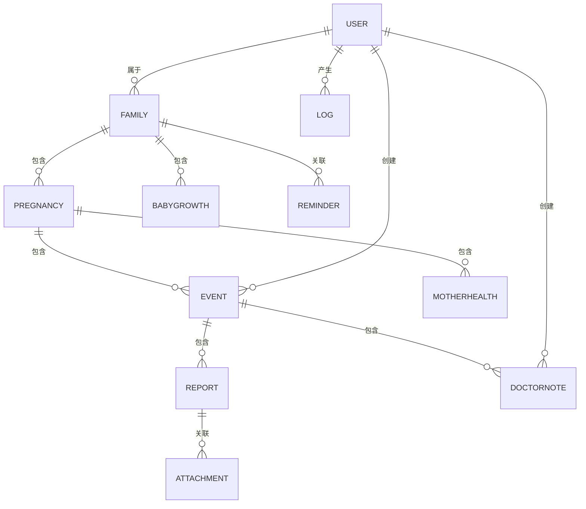
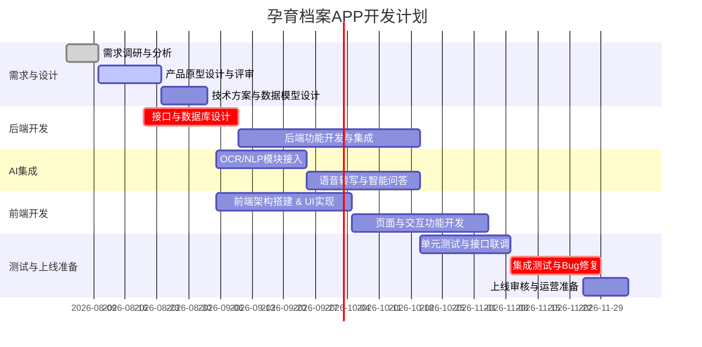

# 执行摘要  
本项目旨在开发一款面向中国大陆“宝爸宝妈”的移动App——**家庭孕育档案**，以电子化管理孕期及早期育儿全程健康数据为核心。北极星目标是一句话描述：**“让每个家庭在孕育过程中，快速查阅并掌握所有关键健康指标与事件。”**核心价值在于将散乱的产检报告、医生建议、母亲反应和宝宝成长记录统一纳入家庭档案，提供智能检索、趋势分析与提醒，帮助用户消除信息焦虑。目标用户为20–40岁之间的准父母（尤其首次孕妈），主要分布于三四线城市、受教育程度本科以上、以企业职员居多。他们关心孕检指标、孕期症状及育儿知识，但常受信息碎片化、经验滞后等痛点困扰。为此，本应用拟实现产检档案扫描与OCR、医生语音摘要、母婴数据趋势可视化和智能提醒等功能，结合AI技术辅助分类和问答服务。技术架构将采用主流跨平台框架+后端API+云存储+AI能力（OCR、NLP、语音转写）方案，保证数据加密与合规。开发计划分月实施，包括需求设计、前后端开发、AI集成、测试上线等阶段；资源上预计需产品、设计、前后端、AI工程、测试、运维、法务等团队配合。风险方面关注技术实现（OCR/NLP准确性）、隐私合规（PIPL要求）、用户留存和数据安全，均提出相应缓解措施。上线后通过与妇幼机构合作、种子用户激励和付费增值服务等手段获取用户并促进留存，同时支持隐私友好的数据导出备份。长远来看，功能路线可覆盖多胎支持、与医院系统对接、知识图谱扩展等。本文最后提供了首月行动周计划，保障项目有序启动。

## 项目定位与北极星目标  
**项目定位**：本App定位为家庭健康管理工具，专注于**孕期及早期育儿全程档案**数字化。与传统母婴类工具不同，它不直接提供孕育指南，而是帮助用户“记住发生了什么”，将孕检报告、医生诊断、母体指标、宝宝成长记录等统一存档。应用场景以准妈妈及新手父母为主，不开放给医生，只供家庭内部使用。  
**北极星目标**（一句话）：*“让每个家庭在孕育过程中，快速查阅并掌握所有关键健康指标与事件。”* 这意味着无论是初次见到彩超报告，还是宝宝接种疫苗，用户都能在此App中迅速定位到相关记录，形成一份完整且可搜索的“家庭孕育档案”。  

## 目标用户画像  
- **年龄与角色**：主要为20–40岁间的孕妇（准妈妈）和她们的伴侣（准爸爸），首次生育者居多。也覆盖关注孕产健康的第三代（祖父母）。  
- **地域与经济**：分布广泛于二三线城市以及部分三线以下地区，本科及以上学历居多。普通企业职工家庭，具备一定消费能力。  
- **需求与痛点**：用户关注怀孕过程中的身体变化（如孕吐、体重、血压）、产检指标（B超、验血）以及胎儿/宝宝成长数据；也关心产后恢复与护理知识。常见痛点包括：对孕产知识缺乏经验（尤其初产）、担心产检报告的复杂指标、传统育儿经验与现代需求脱节等。孕期需要便捷查询历史数据、获取智能提醒，产后需要追踪宝宝成长与母体恢复。  
- **使用频率假设**：孕期阶段用户可能每天或每周使用1–3次，例如查看新产生检报告、记录体重/症状。产后初期（宝宝0–1岁）也会定期记录疫苗、身高体重等（每月或每季度）。随着时间推移使用频率会下降，但应提供长期回顾功能。  

## 竞品分析  

| 产品/功能            | 核心功能                       | AI 能力                           | 隐私策略                              | 商业模式                 | 优势                                  | 劣势                                  |
|:-------------------|:----------------------------|:--------------------------------|:-----------------------------------|:----------------------|:-------------------------------------|:-------------------------------------|
| **宝宝树孕育** | 一站式孕育平台：包括经期管理、孕检日历、胎儿发育图、宝宝成长记录、育儿百科、社区、商城等。 | 部分AI：提供“AI解读B超单”功能、个性化问答（胎儿发育、育儿）等。 | 常规隐私政策，数据用于内容个性化和广告推送；无公开宣称不用于AI训练。 | 广告、电商、会员服务（付费内容）。 | 功能全面，用户基数大（90%母婴群体使用）；社区氛围好；提供部分AI特色功能。 | 商业化偏重，信息较杂；对单一阶段深度不够；对医疗报告处理能力有限。 |
| **亲宝宝** | 亲子成长记录云：支持家人共享照片/视频、记录从孕期到育儿的成长日志、体重身高曲线、疫苗提醒等。 | 智能助手：个性化育儿指导，具备周推胎教指导、成长影集MV制作等；无报告OCR等专用AI。 | 隐私保护较好（强调安全私密空间分享）；需用户登录；涉及电商与会员。 | 自有母婴产品电商、会员订阅。 | 强调隐私与分享，记录形式多样（照片、视频、音乐视频）；UI友好；已自营商品。 | 医疗健康内容相对弱；AI功能主要在照片MV等；商业化以自有品牌为主，用户锁定较强。 |
| **孕e家** | 医院合作胎心监护与孕妇教育：提供专家视频课程、孕期百科、胎监设备远程监护等功能。 | 无明示AI功能。 | 医院背景平台，数据由医院掌控；运营商需合规管理。 | 与医疗设备结合（B2B+免费）。 | 医院合作保障专业性；支持蓝牙胎监设备、在线医生解读；孕妇课堂视频权威。 | 依赖专用硬件（胎监仪）；内容多付费/课程；更新慢，用户评分一般。 |
| **丁香妈妈** / **妈妈社区** | 专业内容+社区：丁香妈妈主打医生撰写的科普文章；妈妈社区（ci123）主打女性互动交流、话题圈。 | AI能力有限，主要依赖人工内容。 | 常规平台隐私政策，数据主要用于内容推荐。 | 广告、电商服务（医院挂号、知识付费）。 | 内容专业性高（丁香妈妈）；社区活跃（妈妈社区）；定位明确。 | 缺少数据归档与AI辅助功能；更多偏信息社区/科普，非工具型产品。 |
| **国内电子健康档案**（例：杭州“母子健康手册”） | 公共卫生平台：电子化孕产妇手册，整合孕前、孕产、儿童保健、预防接种等信息，自动生成动态曲线。 | 基础电子化，暂无AI公开应用。 | 国家卫生平台，数据加密，使用范围受限于诊疗服务。 | 政府资源，无商业模式。 | 官方背书，医疗数据实时互通；自动提醒产检；可生成完整电子手册。 | 只覆盖试点地区（现杭州推广全市）；主要供公共服务，无自定义功能；不面向市场化运营。 |
| **Ovia Pregnancy**（海外） | 孕期追踪：周期预测、健康提醒、知识推送、医生问答等。 | 强AI：使用用户数据训练机器学习模型和大语言模型提供个性化内容。 | 严格隐私政策：数据加密存储；免费版不售卖个人资料；企业版用户数据有限共享。 | 免费+付费订阅（企业方案，如Ovia+与医保/雇主合作）。 | 科研背景强，数据支持决策；内容精准个性化；合规性高。 | 偏企业市场（集成医保计划）；对中国用户不适用；无中文内容。 |
| **The Journey Pregnancy**（美国） | 孕期实时监测：每日健康日志、血压监测、虚拟助产士(Aria)问答、趋势图表等。 | 丰富AI：手机摄像头测血压/心率、智能虚拟助产士、AI生成定制宝宝图像和催眠曲。 | HIPAA合规：数据加密、安全存储；明确不出售用户数据。 | 免费工具（通过合作医院与设备推广）。 | 强调患者自主管理和与医生共享；创意AI功能丰富。 | 面向英语市场，技术依赖特定设备；中国用户使用受限。 |

## 核心功能MVP  
根据定位与用户需求，提炼以下核心功能（按优先级与权重分配）：

1. **孕产事件时间轴（首页） – 40%**  
   - *用户故事*：用户打开App即可看到按时间排序的关键记录（备孕、各次产检、用药、宝宝出生、疫苗等），快速找到任一事件。  
   - *关键交互*：用户可查看不同月份/阶段的时间线图，点击事件查看详情；可手动添加事件（如突发症状、心理日记）。  
   - *输入/输出*：输入包括医生诊断（文字或语音录入）、手动笔记、照片/报告附件；输出为结构化事件记录列表和详情视图。  
   - *AI职责*：根据上传的报告图片自动提取日期和关键结论标签，智能归类事件类型；对医生语音进行转录与摘要（医生回复化为文字备注）。  
   - *非AI说明*：实现事件的CRUD操作、过滤（阶段筛选）、日历视图。  

2. **产检报告智能归档 – 25%**  
   - *用户故事*：用户在医院体检后，将B超、血检等纸质报告拍照上传，App能自动识别并填写记录。  
   - *关键交互*：用户对报告照片进行标记上传，系统提示提取成功并归入对应“事件”或“报告”列表。  
   - *输入/输出*：输入为图像（照片或扫描件）、可附带注释；输出为结构化数据（检查项目名称、结果数值、日期等）并生成报告摘要。  
   - *AI职责*：OCR识别报告中的文字和表格（可选用阿里云OCR医疗模板），自然语言处理提取诊断结论关键词和异常指标，自动填充数据库字段。  
   - *非AI说明*：保存原始附件文件至云存储，维护数据模型中的Report/Attachment关联；对OCR失败的情况允许用户手动输入或校对结果。  

3. **妈妈健康监测和宝宝成长记录 – 15%**  
   - *用户故事*：孕期记录体重、血压、胎动次数，产后宝宝记录身高、体重、接种疫苗等。通过趋势图监测变化。  
   - *关键交互*：图表界面显示随时间增长的孕妇体重曲线、宝宝身高曲线；用户输入每日/每月数据，系统生成提醒（如体重增长过快、应做下一次产检）。  
   - *输入/输出*：输入为母亲健康指标（体重、血压、血糖、症状）、宝宝数据（身高、体重、头围、发育指标）。输出为可视化曲线图、里程碑标记、异常提醒。  
   - *AI职责*：对输入的数据做趋势分析，预测风险（如高血压预警）、提供健康小建议；可基于大数据生成生长曲线对比（例如国家标准生长百叶窗）。  
   - *非AI说明*：实现数据统计、图表绘制、基本提醒逻辑。  

4. **智能提醒与问答 – 10%**  
   - *用户故事*：App自动提醒下一次产检或宝宝接种，用户可查询“我上次产检是什么时候，做了哪些检查”。  
   - *关键交互*：系统推送短信/推送通知（产检预约、服药、体检复查）；App内含智能问答入口，用户可用自然语言提问（“宝宝两岁时多重？”）。  
   - *输入/输出*：输入包括用户语音或文字提问；输出为回答文本或历史数据查询结果。  
   - *AI职责*：NLP问答功能：识别用户问题意图，从用户数据中检索答案；示例：“最近一次超声怀孕几周时做的？”由系统自动检索时间线。  
   - *非AI说明*：提醒规则基于日程表实现；问答后端可简单匹配数据库字段和关键词。  

5. **附加功能（照片/文档管理、权限设置） – 10%**  
   - *用户故事*：用户可以上传孕期和宝宝照片，生成成长相册；可以设置家人（例如爸爸、祖父母）查看权限。  
   - *关键交互*：照片墙、相册浏览；分享二维码邀请家人加入；应用设置隐私选项。  
   - *输入/输出*：输入文件（照片、视频、PDF等），输出为个人图库与家庭相册。  
   - *AI职责*：可选用人脸识别自动给宝宝照片打标签，或对象识别标注陪伴人（非必须）。  
   - *非AI说明*：设计用户账户与权限管理机制，保证信息仅家庭可见；实现文件存储与带宽管理。  

## 数据模型概览  
核心实体与主要字段如下：

| 实体           | 字段             | 类型    | 示例数据                     |
|:-------------|:---------------|:------|:--------------------------|
| **Family（家庭）**   | `id`            | int   | 1                         |
|              | `mother_user_id` | int   | 1001                      |
|              | `father_user_id` | int   | 1002                      |
|              | `city`          | varchar | 北京                       |
|              | `remarks`       | text  | “张三+李四家庭档案”         |
| **Pregnancy（孕期）** | `id`            | int   | 2001                      |
|              | `family_id`     | int   | 1                         |
|              | `start_date`    | date  | 2026-01-10                |
|              | `due_date`      | date  | 2026-10-17                |
|              | `end_date`      | date  | 2026-10-01（实际分娩）     |
|              | `notes`         | text  | “二胎低风险”               |
| **Event/Visit（产检/事件）** | `id`            | int   | 3001                      |
|              | `pregnancy_id`  | int   | 2001                      |
|              | `date`          | date  | 2026-03-05                |
|              | `type`          | varchar | “产检（B超）”             |
|              | `location`      | varchar | “市妇幼保健院”            |
|              | `notes`         | text  | “妊娠风险: 低”            |
| **Report（报告）**   | `id`            | int   | 4001                      |
|              | `event_id`      | int   | 3001                      |
|              | `category`      | varchar | “B超、血检”             |
|              | `summary`       | text  | “羊水量正常，胎儿畸形风险低”   |
|              | `risk_level`    | varchar | “正常”                    |
| **Attachment（附件）** | `id`            | int   | 5001                      |
|              | `parent_type`   | varchar | “Report” 或 “DoctorNote”等 |
|              | `parent_id`     | int   | 4001                      |
|              | `file_path`     | varchar | “oss://bucket/report1.pdf” |
|              | `mime_type`     | varchar | “application/pdf”         |
| **DoctorNote（医生备注）** | `id`            | int   | 6001                      |
|              | `event_id`      | int   | 3001                      |
|              | `audio_file`    | varchar | “oss://bucket/audio1.m4a” |
|              | `transcript`    | text  | “胎位正常...”             |
|              | `summary`       | text  | “建议下月复查”             |
| **MotherHealth（母体健康）** | `id`            | int   | 7001                      |
|              | `pregnancy_id`  | int   | 2001                      |
|              | `date`          | date  | 2026-01-20                |
|              | `weight_kg`     | float | 55.3                      |
|              | `blood_pressure`| varchar | “120/80”                 |
|              | `symptoms`      | varchar | “孕吐、头晕”             |
| **BabyGrowth（宝宝成长）** | `id`            | int   | 8001                      |
|              | `family_id`     | int   | 1                         |
|              | `type`          | varchar | “出生、1岁体检、疫苗”   |
|              | `date`          | date  | 2026-10-01                |
|              | `weight_g`      | int   | 3200                      |
|              | `height_cm`     | int   | 50                        |
|              | `notes`         | text  | “健康足月新生儿”           |
| **Medication（用药）** | `id`            | int   | 9001                      |
|              | `pregnancy_id`  | int   | 2001                      |
|              | `name`          | varchar | “铁剂”                    |
|              | `dosage`        | varchar | “每天1片”                |
|              | `start_date`    | date  | 2026-02-01                |
|              | `end_date`      | date  | 2026-07-01                |
| **Reminder（提醒）**   | `id`            | int   | 10001                     |
|              | `family_id`     | int   | 1                         |
|              | `type`          | varchar | “产检预约、疫苗提醒”    |
|              | `date`          | date  | 2026-08-10                |
|              | `description`   | text  | “五维唐筛+糖耐提示”       |
| **User（用户）**      | `id`            | int   | 1001                      |
|              | `username`      | varchar | “zhangsan”               |
|              | `role`          | varchar | “mother”/“father”       |
|              | `mobile`        | varchar | “13800000000”            |
|              | `family_id`     | int   | 1                         |
| **Auth（认证）**      | `id`            | int   | 11001                     |
|              | `user_id`       | int   | 1001                      |
|              | `password_hash` | varchar | “e10adc3949ba59ab”       |
|              | `salt`          | varchar | “xYz123==”               |
| **Audit（审计日志）** | `id`            | int   | 12001                     |
|              | `user_id`       | int   | 1001                      |
|              | `action`        | varchar | “上传报告”              |
|              | `timestamp`     | datetime | 2026-07-30 14:20:00    |
|              | `details`       | text  | “B超报告识别成功”         |

## 技术架构建议  
- **前端**：采用跨平台开发框架（如Flutter或React Native），兼顾iOS和Android，两者共享大部分业务逻辑，降低开发成本。同时保证原生体验。  
- **后端**：RESTful API架构，使用Spring Boot/Node.js等成熟框架，提供用户、家庭、孕期、事件等接口。数据库可选关系型（MySQL/PostgreSQL）存储结构化数据；全文或关键字检索可集成Elasticsearch。文件（报告、音频、照片）存储使用云对象存储服务（如阿里云OSS或AWS S3），URL存储在数据库中。  
- **搜索与文件存储**：采用云存储和CDN分发，加速附件访问；支持全文搜索（报告摘要、医生笔记）建议使用Search引擎。  
- **AI组件**：OCR可调用阿里云/腾讯云等OCR服务，并使用其医疗专项OCR（支持**医疗报告、体检单识别**）；NLP和摘要可采用大型预训练模型（国内如百度文心、阿里盘古，或开源LLaMA/GPT模型自训）做报告内容提取与医生问答；语音转写可接入讯飞/百度语音识别，将录音转换为文字；知识图谱可选用Neo4j或GraphScope管理实体关系和智能问答索引。  
- **安全与合规**：严格遵守中国《个人信息保护法》（PIPL）及医疗信息相关法规。所有敏感数据（孕检结果、健康记录）在传输和存储时使用加密（TLS+AES256）；对用户身份信息和敏感字段做脱敏或哈希处理。建立权限控制，用户数据仅对家庭成员可见。定期进行安全审计和漏洞扫描；提供数据导出和删除功能，满足用户自主权。数据中心优先使用中国本土云厂商或符合数据本地化要求的服务商。  
- **部署与扩展**：采用容器化部署（Docker+Kubernetes），保证微服务的弹性扩展；后端和AI服务独立部署，AI模型可部署在GPU节点上。初期采用单区部署，后期可多可用区备份。监控指标和日志收集需内置设计。  

## 开发计划（甘特图）  
按照月度分阶段推进：需求分析与设计、后端与AI研发、前端开发、集成测试、上线筹备等。下图为示例甘特图：  

**关键里程碑**：第1个月产出需求文档与原型；第2个月完成后端框架与AI原型；第3-4个月完成前后端核心功能；第5个月进行测试迭代；第6个月准备上线与运营。

## 资源与预算估算  
- **人员配置与人月**：项目团队建议配置**项目经理1人（6人月）**、**产品经理1人（6人月）**、**UI/交互设计1人（4人月）**、**前端开发2人（各6人月）**、**后端开发2人（各6人月）**、**AI工程师1人（6人月）**、**测试1人（6人月）**、**运维1人（4人月）**、**法务/合规0.5人（3人月）**。合计约**45–50人月**。  
- **第三方服务**：OCR/NLP/语音API（如阿里云OCR、讯飞听见）：按调用付费，可预计初期数千元/月；短信/推送服务（阿里云短信、极光推送）：大致几千元/年；云存储（OSS或S3）：按使用量计费，初期预计数百元/月；云服务器（虚拟机）：初期1台应用服务器+1台数据库服务器，粗估每月千元量级。  
- **初期服务器与存储成本**：假设使用国内云厂商，1核2G基础云主机约50元/月，数据库云服务和负载均衡等加上存储费用，每月合计约500元；年预算约6千元。  
- **总预算区间（RMB）**：保守估计开发成本（含人力、设备等）约**100–150万元**；若追求高可靠性与引入外包，则可达**200万以上**；精简方案及自研则可控制在**50–80万**。  

## 风险评估与缓解措施  
- **技术风险**：OCR识别准确率不达标、AI模型误判、语音转写错误等。缓解：引入成熟OCR服务并提供手动校正入口；对关键算法进行多轮测试，遇特殊情况可人工审核；采用国内领先识别引擎（如讯飞、百度、阿里）保障质量。  
- **合规风险**：个人健康数据属敏感个人信息，需严格管理。缓解：在产品启动前进行隐私合规评估，与法务一起设计隐私政策和用户协议；落实“单独同意”机制，明确用户授权场景；定期安全审计和影响评估。  
- **用户留存风险**：工具型应用易被用一次后遗忘。缓解：设计高频使用场景（如提醒、问答）；丰富社交/激励机制（合影相册、成长视频）；留存激励（签到奖励、好友邀请机制）。  
- **AI误识别风险**：OCR/NLP出错可能导致数据不准。缓解：提供人工复核和编辑功能；对报告内容做质量检测，如识别出非数值字符即提示错误；允许用户纠错并持续优化模型。  
- **数据丢失风险**：用户数据极其重要。缓解：多副本备份（跨地域容灾备份）；日志审计；使用可靠的云存储服务；开发数据导出功能，用户可自行备份。  

## 上线后运营与增长策略  
- **种子用户获取**：可与妇幼保健院、产科门诊合作推广；利用孕妈交流微信群/公众号、母婴论坛（如宝宝树、妈妈网）进行宣传；与母婴社群KOL合作举办活动；同时推广给签约家庭医生和产检机构使用。  
- **留存机制**：加强App“每日检查”类功能（每日输入体重、打卡孕育笔记）；推送个性化健康小贴士；设置成长礼物（如宝宝满月、100天等生成纪念册）。提供新功能通知，保持用户关注。  
- **付费点建议**：提供增值服务，如专家在线咨询、专业健康报告解析等；开放丰富模板/滤镜的相册制作；商业合作引入可信医药、电商优惠券。核心数据导出/备份功能可作为高级会员权益（或企业版功能）提供。  
- **隐私友好型数据导出/备份**：支持用户将所有数据导出为PDF或电子档案（本地保存或打印），增加信任感；允许用户删除或匿名化处理旧数据。  
- **长期产品路线图**：  
  - **1年**：增加多胎妊娠支持，丰富女性产后恢复与心理健康模块；上线FAQ/知识库问答功能；优化AI模型准确度。  
  - **3年**：与社区医疗/保险机构合作，实现医疗数据对接、孕产险自动提醒等；拓展儿童成长阶段支持至学龄前，形成母婴全生命周期记录。  
  - **5年**：建设健康知识图谱和智能推荐系统，提供基于大数据的个性化孕产服务；探索跨境输出或扩展到其他母婴服务领域。  

## 附件/交付物清单  
- **产品原型**：建议使用Figma/Sketch等工具制作交互原型，输出在线链接。（示例：*Figma原型文档*）  
- **API接口文档模板**：采用OpenAPI/Swagger规范示例，包括用户管理、档案管理、报告识别等接口示例文档。  
- **数据模型DDL示例**：提供数据库建表SQL样本，如用户表、孕期表、报告表的DDL脚本，便于后续开发参考。  
- **测试用例模板**：列出功能模块（用户、报告OCR、提醒、问答等）和对应测试场景及预期结果的模板文档。  
- **隐私合规清单模板**：包括用户隐私信息分类、数据处理目的、用户授权记录、数据存储期限、审计流程等项目列表，确保符合PIPL要求。  

## 结论与推荐  
总体而言，本项目可填补中国市场上“家庭孕育档案”管理的空白，为准父母提供真正**全程可回溯、可信任的健康数据管理**工具。其差异化在于**围绕“家庭”而非单一角色构建档案**，兼顾妈妈、宝宝和其他家庭成员的需求，辅以AI技术提升效率和体验。建议项目优先实现核心MVP功能（报告OCR归档、事件时间轴、健康监测、智能提醒），分阶段推出；同时严格遵循中国法律法规，确保平台合法合规。通过与医疗机构和母婴社区的合作推广、用户口碑传播，可在初期迅速聚拢目标用户群。团队可在获取早期反馈后，持续迭代算法和产品体验，逐步拓展服务边界（如更多AI功能、本地化服务、电商增值等）。  

**首月行动计划（周级）**：

| 周次    | 主要任务与交付物                                             |
|:------|:----------------------------------------------------------|
| 第1周   | **需求分析与竞品调研**：细化产品定位、北极星目标和用户画像；调研国内外竞品功能和技术实施情况；形成《需求说明书》草案。 |
| 第2周   | **MVP功能定义与原型设计**：确定核心功能列表和优先级，撰写产品PRD（功能描述、用户故事）；设计低保真原型，并组织评审。 |
| 第3周   | **技术方案评审**：制定技术架构方案（前后端、AI、数据存储等）；设计核心数据模型和ER图；输出《技术方案文档》并评审。 |
| 第4周   | **开发环境与计划**：搭建开发环境（代码仓库、CI/CD、测试环境）；细化各里程碑甘特图；团队分工明确；准备API文档模板初稿。 |